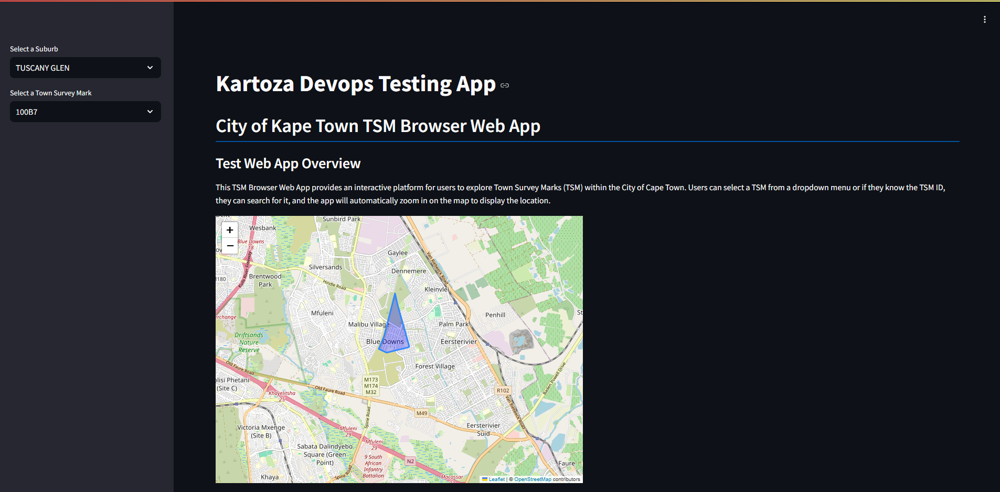

Kartoza DevOps Testing web-app
==============================

The Kartoza DevOps web-app is designed to serve as a simple testing web app for managing and evaluating changes within the Software Development Life Cycle (SDLC). Its primary purpose is to provide developers and DevOps teams with a simple, robust  scalable to deploy, test, and monitor web applications in a controlled setting.

## About the Web-App
The Web-App is a Streamlit Dashboard that is connected to an SQLite Database that holds a subset of the records of the Town Survey Marks situated in the Cape Town region. (The Data is courtsy of the [City of Cape Town's Open Data Portal](https://odp-cctegis.opendata.arcgis.com/datasets/4ee4fef293d74436afe31c2b979dfb30_14/about).) The web app makes it possible for user to select a TSM from a dropdown menu or if they know the TSM ID, they can search for it, and the app will automatically zoom 
in on the map to display it's location. 

## Usage
### 1. Clone the Repository:
```bash
git clone https://github.com/kartoza/devops-app
```

### 2. Navigate to the Project Directory:
```bash
cd devops-app
```
### 3. Build the app container image:
Make the build bash script executable:
```bash
chmod +x build_image.sh
```

Run the script:
```bash
./build_image.sh
```

### 4. Run the container from the image:
```bash
docker run -d --name kartoza_devops_app_container -p 8501:8501 kartoza_devops_app
```

### 5. Check that the container is running and the app is running locallly
```bash
docker ps 
```
You should find a container named `kartoza_devops_app_container` in the running containers list. It's healthcheck should be `healthy`. 

### 6. Access the app locally
 Go to a browser and access the app via this url:
 ```
 http://localhost:8501/
 ```

You should be able to see the web-app interface as such:


## Health Checks
- A health check for the web-app container has been set up in in the Dockerfile to automatically check the health of the container. The health check makes a curl request internally so see if the Streamlit app is still accessible via ists local access url.
